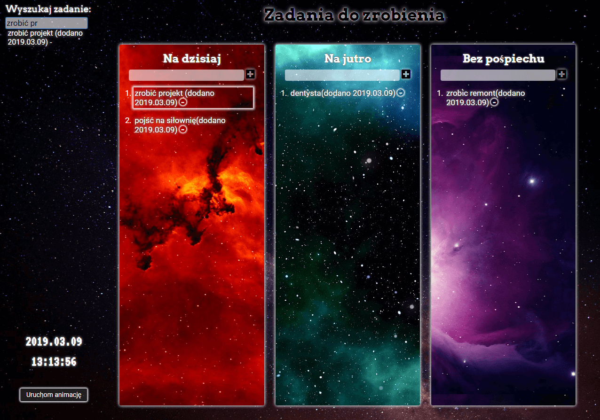

# To-do-list

It's just another "to do" app and my first repository in GitHub.
I used JS, CSS and HTML

## Screenshot

## Technologies

- HTML
- CSS
- JavaScript

## Setup

[Link to demo version](https://pawelniziolek.github.io/another-to-do-list-in-JS/index.html)

## Features

To-do list:

- Search engine to do
- The ability to stop the animation

## Status

Project is: _finished_

## Contact

Created by Paweł Niziołek e-mail: pawel.r.niziolek@gmail.com - contact me!
